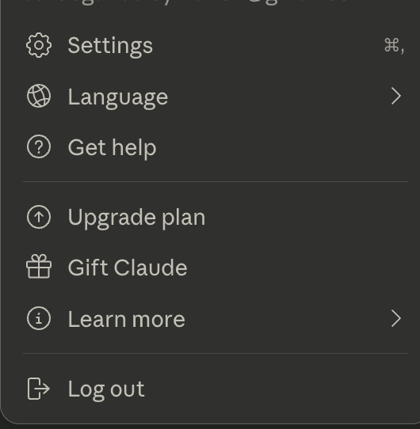
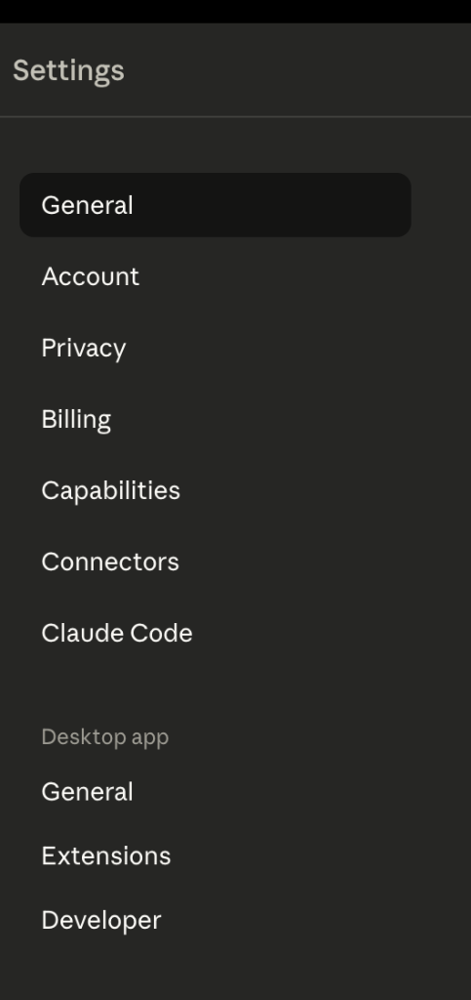
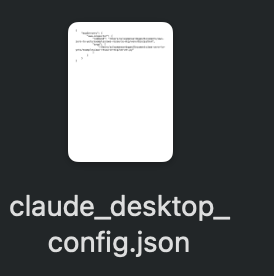
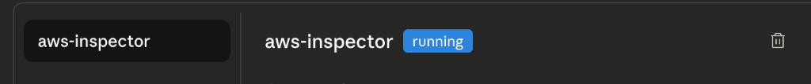

# 🕵️‍♂️ AWS Resource Inspector - MCP for Claude

**AWS Hesabınızı Yapay Zeka ile Konuşturun!** ☁️🤖

Bu proje, Claude Desktop uygulamanıza AWS hesabınızı (güvenli ve salt-okunur modda) bağlamanızı sağlar. Artık terminalde komut yazmak yerine, Claude'a "Sunucularımın durumu ne?" diye sorabilirsiniz.

---

## ✨ Neler Yapabilir?

Claude bu araç sayesinde aşağıdaki kaynakları **görebilir** (fakat değiştiremez veya silemez):

*   📦 **S3:** Bucket listesi ve içindeki dosyalar.
*   💻 **EC2:** Sunucular, IP adresleri, tipleri ve **Availability Zone** bilgileri.
*   ⚡ **Lambda:** Fonksiyonlar, çalışma zamanları (runtime) ve detayları.
*   🗄️ **DynamoDB:** Tablolar, durumları ve içerik sayıları.

---

## �️ Kurulum Rehberi

Aşağıdaki adımları takip ederek 2 dakika içinde kurabilirsiniz.

### 1. Gereksinimler
*   Bilgisayarınızda **Python (3.10+)** yüklü olmalı.
*   **AWS CLI** yüklü ve ayarlanmış olmalı (`aws configure` komutu çalışıyor olmalı).
*   **Claude Desktop** uygulaması yüklü olmalı.

### 2. Kurulum Kodları

Terminal veya Komut İstemi'ni (CMD/PowerShell) açın ve proje klasörüne gidin.

#### 🍎 macOS / 🐧 Linux Kullanıcıları
```bash
# Proje klasörüne girin
cd examples/aws-resource-mcp

# Sanal ortam oluşturun
python3 -m venv venv

# Ortamı aktif edin
source venv/bin/activate

# Gerekli paketleri yükleyin
pip install -r requirements.txt
```

#### 🪟 Windows Kullanıcıları
```powershell
# Proje klasörüne girin
cd examples\aws-resource-mcp

# Sanal ortam oluşturun
python -m venv venv

# Ortamı aktif edin
venv\Scripts\activate

# Gerekli paketleri yükleyin
pip install -r requirements.txt
```

---

## 🔌 Claude'a Bağlama (Sihirli Adım)

Bu adımda Claude'a "Bak, benim aracım burada çalışıyor" diyeceğiz.

1.  **Claude Desktop** uygulamasını açın.
2.  **Ayarlar (Settings)** menüsüne gidin:
    *   Claude desktop'ı açıp sol alttaki profil kısmının üstüne basınız, açılan pencereden **"Settings"** e basınız.
    *   Alternatif olarak *Mac:* `Cmd + ,` (Virgül) kısayolu veya üst menüden `Claude > Settings`.
    *   Alternatif olarak *Windows:* `File > Settings`.
    
    

3.  Ayarlar penceresi açıldığında, sol taraftaki menüden **"Developer"** (Geliştirici) sekmesine tıklayın.
    

4.  Developer ekranında, yerel MCP sunucularını yönetmemizi sağlayan **"Edit Config"** (Yapılandırmayı Düzenle) butonuna tıklayın. Bu işlem, varsayılan metin editörünüzde bir ayar dosyası açacaktır.
    

5.  Açılan `claude_desktop_config.json` dosyası, Claude'un tanıdığı araçları listeler. Dosya içeriği buna benzer görünecektir:
    
6.  Açılan dosyanın içine, işletim sisteminize uygun olan aşağıdaki kodu yapıştırın.
    *(⚠️ ÖNEMLİ: Dosya yollarını (Path) kendi bilgisayarınızdaki gerçek yollarla değiştirmeyi unutmayın!)*

#### 🍎 macOS Config Örneği:
```json
{
  "mcpServers": {
    "aws-inspector": {
      "command": "/Users/ADINIZ/Documents/projeler/aws-zero-to-yeto/examples/aws-resource-mcp/venv/bin/python",
      "args": [
        "/Users/ADINIZ/Documents/projeler/aws-zero-to-yeto/examples/aws-resource-mcp/server.py"
      ]
    }
  }
}
```

#### 🐧 Linux Config Örneği:
```json
{
  "mcpServers": {
    "aws-inspector": {
      "command": "/home/KULLANICIADI/projeler/aws-resource-mcp/venv/bin/python",
      "args": [
        "/home/KULLANICIADI/projeler/aws-resource-mcp/server.py"
      ]
    }
  }
}
```

#### 🪟 Windows Config Örneği:
Dikkat: Windows yollarında çift ters eğik çizgi `\\` kullanmalısınız.
```json
{
  "mcpServers": {
    "aws-inspector": {
      "command": "C:\\Users\\ADINIZ\\Documents\\projeler\\aws-resource-mcp\\venv\\Scripts\\python.exe",
      "args": [
        "C:\\Users\\ADINIZ\\Documents\\projeler\\aws-resource-mcp\\server.py"
      ]
    }
  }
}
```

---

## 🚀 Nasıl Kullanılır?

1.  Ayar dosyasını kaydedip kapatın.
2.  **Claude uygulamasını tamamen kapatıp (Quit) yeniden açın.**
3.  Developer  sekmesinde aktif olup olmadığına bakabilirsiniz.
    
4.  Artık sohbet etmeye başlayabilirsiniz!

**💬 Örnek Sorular:**

> "AWS hesabımda hangi S3 bucketları var ve ne zaman oluşturuldular?"

> "Oluşturduğum 'yedekler-bucket'ımın içinde hangi dosyalar var?"

> "us-east-1 bölgesinde çalışan EC2 sunucum var mı? Varsa hangi Availability Zone'da?"

> "Lambda fonksiyonlarımı ve kullandıkları dilleri (runtime) listele."

> "DynamoDB tablolarımın durumu nedir, kaçar tane veri var?"

---

## 🧪 Test Ortamı (Demo)

Eğer AWS hesabınız boşsa ve MCP'yi denemek için hızlıca örnek kaynaklar (Bucket, Lambda, DynamoDB) oluşturmak isterseniz hazır scriptleri kullanabilirsiniz:

```bash
# Test kaynaklarını oluştur (1 adet S3, Lambda ve DynamoDB)
./deploy.sh

# İşiniz bitince hepsini temizle
./cleanup.sh
```

---

## 🔒 Güvenlik Notu
Bu araç, AWS kimlik bilgilerinizi kullanarak **sadece okuma (read-only)** işlemleri yapar. Kaynaklarınızı silmez, değiştirmez veya masraf çıkaracak işlemler yapmaz (Liste işlemlerinin maliyeti ihmal edilebilir düzeydedir).

---

## 🚀 Sonraki Adımlar (Geliştirme Fikirleri)

Bu projeyi daha da ileriye taşımak isterseniz şunları deneyebilirsiniz:

1.  **🔍 CloudWatch Logs**: Lambda fonksiyonlarınızın hata loglarını (ERROR) okuyan bir araç ekleyin.
2.  **💰 Cost Explorer**: "Bu ay ne kadar harcadım?" sorusuna cevap verecek bir fatura aracı ekleyin.
3.  **🔔 Alarm Durumları**: CloudWatch alarmlarını kontrol edip "Kritik durumda olan alarm var mı?" sorusunu cevaplayın.
4.  **🏗️ Infrastructure as Code**: AWS kaynaklarını (CloudFormation veya Terraform) okuyup analiz edebilen yetenekler kazandırın.
5.  **📢 Slack Entegrasyonu**: Kritik alarmları, maliyet raporlarını veya sistem durumunu doğrudan Slack üzerinden ekibinizle paylaşın.
