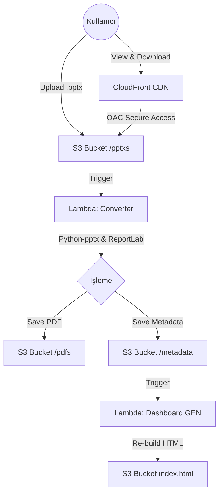
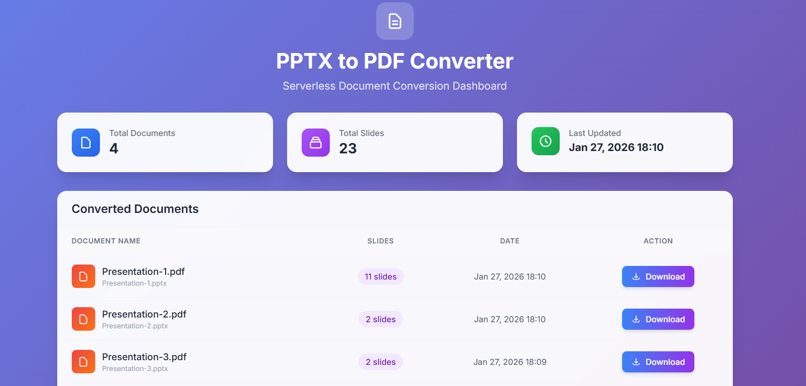
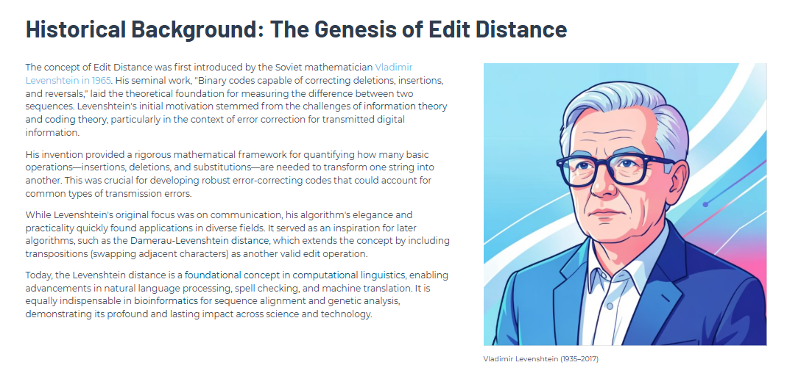
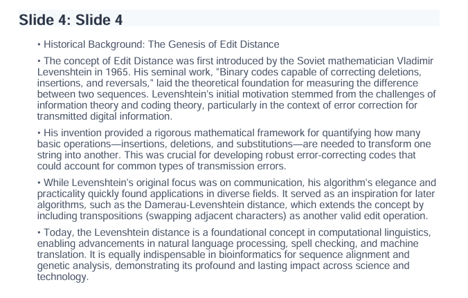

# 📑 Serverless PPTX to PDF Converter & Dashboard

Bu proje, AWS üzerinde çalışan, olay güdümlü (event-driven) ve tamamen serverless bir doküman dönüştürme sistemidir. S3'e yüklenen PowerPoint (.pptx) dosyalarını otomatik olarak PDF'e dönüştürür ve sonucu Tailwind CSS ile oluşturulmuş dinamik bir dashboard üzerinden sunar.

**Senaryo**: Kullanıcı S3'e dosya yükler → Lambda tetiklenir ve dönüştürür → Sonuçlar kaydedilir → İkinci bir Lambda Dashboard'u (HTML) günceller → Kullanıcı CloudFront üzerinden güvenli bir şekilde erişir.

## 🏗️ Mimari

Proje, **CodeArtifact** ile bağımlılık yönetiminden **CloudFront OAC** ile güvenliğe kadar modern bir mimari kullanır.



## 🚀 Kullanılan Teknolojiler & Servisler

* **AWS Lambda**: Dönüştürme ve HTML oluşturma mantığı (Python 3.11).
* **Amazon S3**: Dosya depolama ve olay tetikleyicisi.
* **Amazon CloudFront**: İçerik dağıtımı ve HTTPS güvenliği (Origin Access Control ile).
* **AWS CodeArtifact**: Lambda Layer için güvenli Python kütüphane yönetimi.
* **Python Kütüphaneleri**: `python-pptx` (parse), `reportlab` (PDF generation).
* **Bash Scripting**: Infrastructure as Code (IaC) mantığında otomatik kurulum.

## 📋 Gereksinimler

Projenin kurulumu için bilgisayarınızda şunların yüklü olması gerekir:

* **AWS CLI** (Yapılandırılmış ve `us-east-1` gibi bir bölge seçilmiş)
* **Python 3.x** (Scriptler içinde JSON parse işlemleri için kullanılır)
* **Bash Terminal** (Windows için Git Bash veya WSL önerilir)
* **Zip Utility** (Lambda paketlemesi için)

## 🚀 Kurulum (Deployment)

Proje, altyapıyı ve kodları tek komutla kuran akıllı bir script içerir.

1. **Projeyi klonlayın ve klasöre gidin:**
```bash
cd pptx-converter

```


2. **Kurulum scriptine yetki verin ve çalıştırın:**
```bash
chmod +x deploy.sh cleanup.sh
./deploy.sh

```


Script sırasıyla şunları yapacaktır:

* CodeArtifact domain ve reposunu kurar.
* `python-pptx` ve `reportlab` kütüphanelerini indirip Linux uyumlu bir **Lambda Layer** oluşturur.
* IAM Rollerini ve S3 Bucket'ı hazırlar.
* CloudFront dağıtımını ve OAC ayarlarını yapar.
* Lambda fonksiyonlarını deploy eder ve S3 triggerlarını bağlar.

> **Not:** Kurulum CloudFront dağıtımı nedeniyle yaklaşık 3-5 dakika sürebilir.

## 💻 Nasıl Kullanılır?

Kurulum bittiğinde terminal size bir **CloudFront URL**'i verecektir.

### 1. Dosya Yükleme

Oluşturulan S3 bucket'ındaki `pptxs/` klasörüne bir sunum dosyası yükleyin:

```bash
# Örnek dosya yükleme
aws s3 cp sunum.pptx s3://OLUSTURULAN-BUCKET-ADI/pptxs/

```

### 2. İşlemi İzleme

Dosya yüklendiği anda:

1. **Converter Lambda** çalışır, metinleri çeker ve PDF oluşturur (`pdfs/` klasörüne).
2. **Dashboard Lambda** çalışır, yeni dosyayı algılar ve `index.html`'i günceller.

### 3. Sonucu Görüntüleme

Terminalde verilen CloudFront adresine tarayıcınızdan gidin (`https://xyz.cloudfront.net`). Dashboard'da dosyanızı, slayt sayısını ve indirme linkini göreceksiniz.

## 📊 Test Etme & Debug

Eğer bir şeyler ters giderse veya sistemi izlemek isterseniz:

**Logları Canlı İzleme:**

```bash
# Converter Lambda Logları
aws logs tail /aws/lambda/pptx-converter-function --follow

# Dashboard Lambda Logları
aws logs tail /aws/lambda/pptx-dashboard-function --follow

```

**Metadata Kontrolü:**

```bash
aws s3 ls s3://OLUSTURULAN-BUCKET-ADI/metadata/

```

## 🧹 Temizlik (Cleanup)

Projeyi ve oluşturulan **tüm AWS kaynaklarını** (Loglar, Bucket, Lambda, CloudFront, CodeArtifact vb.) tek komutla silmek için:

```bash
./cleanup.sh

```

> **Uyarı:** Bu işlem geri alınamaz ve S3 bucket içindeki tüm dosyaları siler.

## 📚 Neler Öğrendiniz?

Bu proje ile şunları deneyimlemiş oldunuz:

* **Serverless SSG**: Lambda ile dinamik olarak Static HTML (Dashboard) üretimi.
* **Cross-Platform Lambda Layers**: Windows/Mac üzerinde çalışırken CodeArtifact kullanarak Linux uyumlu binary paketleme.
* **Event-Driven Chaining**: Bir Lambda'nın çıktısının (Metadata JSON), başka bir Lambda'yı tetiklemesi.
* **Security Best Practices**: S3'ü public erişime kapatıp sadece CloudFront OAC ile erişim verme.

---

## 🔮 Gelecek Geliştirme Fikirleri (Roadmap)

Projeyi daha ileriye taşımak için şu özellikleri ekleyebilirsiniz:

### 1. AI ile Özetleme (Bedrock Entegrasyonu)

Mevcut yapıya üçüncü bir Lambda ekleyerek veya Converter Lambda'yı güncelleyerek:

* PPTX içinden çıkarılan metinleri **Amazon Bedrock (Claude 3)** modeline gönderin.
* Prompt: *"Aşağıdaki sunum metnini analiz et ve 3 maddelik yönetici özeti çıkar."*
* Çıkan özeti `summary/` klasörüne `.txt` veya `.json` olarak kaydedin.
* Dashboard Lambda'sını güncelleyerek bu özeti arayüzde "AI Özeti" butonu altında gösterin.

### 2. Görsel İşleme

* Şu an sadece metinler çekiliyor. `python-pptx` kullanarak slayt içindeki görselleri de extract edip PDF'e ekleyebilirsiniz.

### 3. Kullanıcı Arayüzü (Upload)

* S3 Presigned URL kullanarak Dashboard'a bir "Dosya Yükle" butonu ekleyip, CLI kullanmadan tarayıcıdan sürükle-bırak ile yükleme yapabilirsiniz.


## Screenshots

### 1. UI


### 1. PPTX


### 1. PDF
